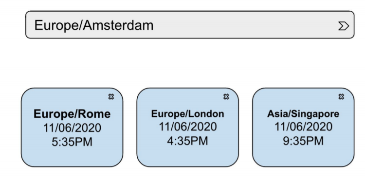

# World clock exercise (Client)
This is a React challenge 

## The requirements are:
Create a front-end app that shows a search bar (autocomplete) that looks for timezones and allows the user to add/delete different timezones for displaying them. See the image below.
The timezone boxes should be responsive, meaning that for mobile views the boxes should be placed one over the other. For desktop view, the maximum number of boxes should be 3 per row.

[API link here](http://worldtimeapi.org/api/timezone)

## Will be considered a plus
- Add an autorefresh set to 5 sec

## How to run the app 
This is a CRA project, you can run it using `npm start`

## How to run the test
To run the tests you can use `npm run test`

